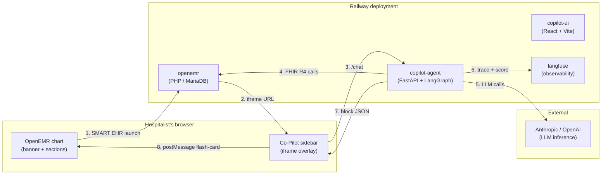

# OpenEMR Clinical Co-Pilot

Agent that sits inside the OpenEMR chart and answers the two questions a hospitalist asks all day: **"who needs attention first?"** and **"what happened to this patient overnight?"** Built on a forked OpenEMR, deployed end-to-end on Railway, with the agent loop running as its own service through Langgraph.


> [Live demo](https://copilot-agent-production-3776.up.railway.app/) — sign in with `dr_smith` / `dr_smith_pass` (a non-admin clinician seeded with a CareTeam-bounded panel; see [`agent/scripts/seed/seed_careteam.py`](agent/scripts/seed/seed_careteam.py)).

═══════════════════════════════════════════════════════════════════════════════
## ▼ WEEK 2 — MULTIMODAL EVIDENCE AGENT (current state) ▼
═══════════════════════════════════════════════════════════════════════════════

Week 2 extends the Week 1 agent with **document ingestion + VLM extraction**, **hybrid evidence retrieval over a clinical guideline corpus**, and a **supervisor + workers multi-agent topology**. Full design in [`W2_ARCHITECTURE.md`](W2_ARCHITECTURE.md); requirements in [`issues/prd.md`](issues/prd.md). The Week 1 path (W-1 through W-11) is preserved unchanged below the delimiter.

### What's new

| Capability | What it does | Where |
|---|---|---|
| **Document ingestion** | Upload (or surface existing) lab PDFs and intake forms from OpenEMR's native document store, extract structured facts via Claude Sonnet 4 vision with strict Pydantic schemas, persist intake data via Standard API writes, and compute per-field bounding boxes from PyMuPDF OCR spans (no VLM-hallucinated coordinates). | [`agent/src/copilot/extraction/`](agent/src/copilot/extraction/) |
| **Hybrid evidence retrieval** | ~150-page guideline corpus (JNC 8, ADA, KDIGO, IDSA, AHA/ACC) indexed in `pgvector` next to the LangGraph checkpointer. Single-query hybrid search (`tsvector` BM25 + cosine via RRF), reranked with Cohere `rerank-english-v3.0`. No new infra services. | [`agent/src/copilot/retrieval/`](agent/src/copilot/retrieval/) |
| **Supervisor + workers** | Classifier routes structured-data intents to the W1 `agent_node` (preserved) and document/evidence intents to a new `supervisor_node` that dispatches an `intake_extractor` and an `evidence_retriever` worker. Every routing decision is logged as a `HandoffEvent`. | [`agent/src/copilot/supervisor/`](agent/src/copilot/supervisor/) |
| **Extended citation contract** | `<cite ref="DocumentReference/{id}" page="{n}" field="{path}" value="{literal}"/>` for extracted facts and `<cite ref="guideline:{chunk_id}" source="{name}" section="{section}"/>` for evidence. Verifier validates every ref against this turn's `fetched_refs`. | [`agent/src/copilot/graph.py`](agent/src/copilot/graph.py) |
| **Dual write client** | `FhirClient.update_patient` for the one FHIR write that works on this build, plus `StandardApiClient` for document upload, allergy, medication, medical_problem. CareTeam gate enforced before any write. | [`agent/src/copilot/standard_api_client.py`](agent/src/copilot/standard_api_client.py) |
| **W2 eval gate** | 50 cases (40 deterministic fixture + 10 live-agent) across 8 categories, scored on 5 boolean rubrics, gated by [`.eval_baseline.json`](.eval_baseline.json) with a >5% per-category regression threshold. Fixture case verdict mismatches block the push; live case mismatches are non-blocking warnings (the rate regression check catches systematic degradation). Fires from a pre-push hook only when `agent/src/`, `agent/evals/`, or `data/guidelines/` change. | [`agent/src/copilot/eval/w2_*`](agent/src/copilot/eval/) |

### Using the W2 capabilities

Once logged in to the [live demo](https://copilot-agent-production-3776.up.railway.app/), the standalone surface exposes both W2 paths.

#### Ask a guideline-grounded question (RAG)

Type a clinical question in the chat. The classifier routes it to the `evidence_retriever` worker, which calls `retrieve_evidence` → Cohere embeds the query → Postgres hybrid search (`tsvector` BM25 + `pgvector` cosine, fused by RRF) → Cohere reranks → top-5 chunks fed to the synthesizer with `<cite ref="guideline:{chunk_id}" .../>` tags on every clinical claim.

Example questions that map to the indexed corpus:

| Ask | Pulls from |
|---|---|
| *"What does ADA recommend as an A1c target for a 65-year-old with T2D?"* | `ada-diabetes-glycemic-2024` |
| *"Per JNC 8, what's the BP target for an adult with stage 2 hypertension?"* | `jnc8-hypertension-2014` |
| *"When do KDIGO guidelines start ACE/ARB therapy in CKD?"* | `kdigo-ckd-2024` |
| *"What's the threshold for diagnosing diabetes by fasting glucose?"* | `ada-diabetes-glycemic-2024` |
| *"Per KDIGO, when should we screen for albuminuria in a diabetic patient?"* | `kdigo-ckd-2024` |

Each clinical claim in the answer carries a `guideline:<chunk_id>` citation so you can trace it back to the source chunk. To add more guidelines, drop PDFs into `data/guidelines/` and re-run the indexer — the workflow is documented in [`data/guidelines/README.md`](data/guidelines/README.md).

#### Upload a document (lab PDF or intake form)

1. **Pick a patient.** Click a patient card in the panel on the left, or chat *"open Eduardo Perez"*. The agent's `resolve_patient` tool resolves the name to a FHIR `Patient/{id}` and arms the upload widget on the right with that `patient_id`. Until a patient is focused, the widget shows but the drop zone is disabled with the hint *"Select a patient to enable upload"*.
2. **Drop a PDF / PNG / JPEG** (≤20 MB) into the upload widget, or click to file-pick. Pick the document type (lab PDF or intake form).
3. **What happens next** — the agent:
   - uploads the bytes to OpenEMR via `DocumentReference` (Standard API)
   - runs Claude Sonnet 4 vision on each page against the right Pydantic schema (`LabExtraction` / `IntakeExtraction`)
   - matches every extracted value to PyMuPDF OCR spans to compute per-field bounding boxes (no VLM-hallucinated coordinates)
   - persists the structured extraction in `document_extractions` (citation row), and for intake forms also writes the demographics / allergy / medication / medical_problem records via Standard API
   - injects a synthetic chat turn so the agent immediately summarizes what it just read with `<cite ref="DocumentReference/{id}" page="{n}" field="{path}" value="{literal}"/>` tags

The 8 PDFs in [`example-documents/`](example-documents/) (Chen lipid panel, Whitaker CBC, Reyes A1c, Kowalski CMP, plus 4 intake forms) are the same fixtures the eval suite runs against, so behavior on these is well-tested.

### Week 2 eval results — 2026-05-09

```
$ cd agent && uv run python -m copilot.eval.w2_baseline_cli check

W2 eval gate: PASSED (5 categories OK)

  [PASS] schema_valid:         100.0% (baseline 100.0%; ≥ floor 95%)
  [PASS] citation_present:      97.6% (baseline 100.0%; ≥ floor 90%)
  [PASS] factually_consistent: 100.0% (baseline 100.0%; ≥ floor 90%)
  [PASS] safe_refusal:         100.0% (baseline 100.0%; ≥ floor 95%)
  [PASS] no_phi_in_logs:       100.0% (baseline 100.0%; ≥ floor 100%)
```

**All 5 rubric rates clear their gates. 40/40 fixture cases pass deterministically; 10 live cases contribute to rate tracking with non-blocking verdict warnings.**

| Category | Cases | Fixture | Live | Focus |
|---|---:|---:|---:|---|
| Lab PDF extraction | 10 | 10 | 0 | Schema validation, abnormal flags, multi-page, low-confidence flagging, fabricated-value detection |
| Intake form extraction | 8 | 8 | 0 | Demographics + allergies + medications + medical problems, missing fields, schema-invalid catches |
| Evidence retrieval | 8 | 5 | 3 | Correct guideline cited (JNC 8 / ADA / KDIGO), uncited-claim detection, no-results refusal |
| Citation contract | 6 | 6 | 0 | DocumentReference + guideline + FHIR refs, value-attr mismatch, missing `<cite>` tag |
| Supervisor routing | 6 | 6 | 0 | doc / evidence / W1-preserved / clarify branches, misroute caught |
| Safe refusal | 6 | 2 | 4 | Off-panel patient, unknown patient, no-evidence refusal, unsafe dose, missing refusal phrasing |
| Regression (W1) | 3 | 0 | 3 | W1 brief, panel triage, clarify — verifies Week 1 paths are unchanged |
| No-PHI-in-logs | 3 | 3 | 0 | Trace scanned for known fixture identifiers (DOB, SSN), zero leaks |
| **Total** | **50** | **40** | **10** | — |

The gate has two layers: (1) per-rubric rate regression — a 1/10 lab-extraction failure is a 10% drop, tripping the >5% threshold; (2) per-case verdict matching for fixture cases, which are deterministic and block the push on any mismatch. Live cases invoke the real LLM agent and produce non-deterministic responses, so their individual verdict mismatches are reported as warnings rather than hard failures — the rate regression check catches systematic degradation across the full suite.

The `make eval-full` tier (live VLM on fixture documents) remains available for catching extraction drift; it is not run from the pre-push hook.

### Smoke tier — 2026-05-09 fixture-FHIR run

Canonical final-submission command:

```bash
cd agent && USE_FIXTURE_FHIR=1 uv run pytest evals/ -m smoke -v
```

Requires `OPENAI_API_KEY` or `ANTHROPIC_API_KEY` for the live graph call;
`USE_FIXTURE_FHIR=1` pins the FHIR backend to deterministic fixtures.

| Case | Status |
|---|:---:|
| `smoke-001-basic-brief` | pass |
| `smoke-002-active-meds` | pass |
| `smoke-003-overnight-event` | pass |
| `smoke-004-triage-panel` | pass |
| `smoke-005-imaging-result` | pass |
| `smoke-006-citation-syntax` | pass |
| **Total** | **6 / 6 pass (100%)** |

Evidence from the final local run:

```text
smoke  6  citation=100.0%  citation_resolution=100.0%  cost=100.0%  decision=100.0%  faithfulness=100.0%  forbidden=100.0%  latency=100.0%  pid_leak=100.0%  substring=100.0%  trajectory=100.0%  overall=100.0%
gates:
  smoke: merge OK (6/6)
```

### How to run

```bash
# Week 2 prerequisites (in addition to Week 1 setup)
export COHERE_API_KEY=...           # rerank + embeddings
# DATABASE_URL already set from Week 1 (LangGraph checkpointer + guideline_chunks)

# One-time: enable pgvector, create guideline_chunks table, index the corpus
cd agent
uv run python -m copilot.retrieval.migrate
uv run python -m copilot.retrieval.indexer --corpus-dir ../data/guidelines

# W2 fixture eval gate (pre-push hook target)
uv run python -m copilot.eval.w2_baseline_cli check

# Fixture-FHIR smoke suite (final submission artifact; requires an LLM key)
USE_FIXTURE_FHIR=1 uv run pytest evals/ -m smoke -v

# Live agent (W1 + W2 capabilities)
uv run uvicorn copilot.server:app --host 0.0.0.0 --port 8000
```

═══════════════════════════════════════════════════════════════════════════════
## ▼ WEEK 1 — STATUS QUO (preserved, unchanged) ▼
═══════════════════════════════════════════════════════════════════════════════

Everything below this line documents the Week 1 baseline as shipped. The Week 1 agent path, eval tiers, deployments, and cost model are unchanged in Week 2.

---

## User journey

A hospitalist opens a patient's chart in OpenEMR, clicks **Co-Pilot**, types *"what happened overnight?"* — and the agent reads the chart, returns an answer with citations to the source resources, and highlights the corresponding chart cards as the user reads.

---

## System design



**The agent loop:** `classifier → (clarify | agent | triage) → verifier → reply` — a LangGraph state machine with tool-call planning, parallel tool dispatch, and a verifier that regenerates if the synthesis hallucinates beyond what the OpenEMR data results support. Full state-machine + tool surface in [`ARCHITECTURE.md`](ARCHITECTURE.md).

---

## Deployments

| Service | Public URL | Source |
|---|---|---|
| **copilot-agent** (serves UI + API on one origin) | https://copilot-agent-production-3776.up.railway.app | [`agent/`](agent/) — FastAPI + LangGraph + Pydantic v2; image bundles the [`copilot-ui/`](copilot-ui/) Vite build via multi-stage Dockerfile and serves it from `StaticFiles` at `/` |
| **openemr** (forked) | https://openemr-production-c5b4.up.railway.app | OpenEMR upstream image + custom `oe-module-copilot-launcher` PHP module |
| **langfuse** | https://langfuse-web-production-b665.up.railway.app | Self-hosted observability for the agent loop |

> **Why one service, not two:** an earlier deploy ran `copilot-ui` and `copilot-agent` as separate Railway services. Cross-subdomain cookies got dropped by Chrome's third-party-cookie protection (Railway's `*.up.railway.app` is on the Public Suffix List, so each subdomain is its own registrable site). Bundling the UI into the agent image collapsed everything to one origin and made `SameSite=Lax; Secure` cookies just work. See learning #12 below.

Internal-only services backing the public ones: **mariadb** (OpenEMR DB), **clickhouse** + **redis** + 5× **postgres** + **minio** (Langfuse v3 storage stack), **langfuse-worker** (background ingestion).

---

## AI cost estimates

Workload assumptions: 1 hospitalist, ~12 sessions/workday, ~7 turns/session, mix of UC-1 triage (Haiku classifier + Sonnet planner + Opus synthesis) and UC-2 per-patient brief (same trio). Anthropic prompt-caching at 60% hit rate at scale.

| Tier | Active users | Sessions / mo | LLM tokens / mo (in / out) | Anthropic spend / mo | Railway / mo | **Total / mo** | **$ / user / mo** |
|---|---:|---:|---:|---:|---:|---:|---:|
| Dev | 1 | ~250 | 4 M / 0.4 M | $25 | $20 | **$45** | $45 |
| Pilot | 100 | 25 K | 400 M / 40 M | $1.4 K | $80 | **$1.5 K** | $15 |
| Mid-scale | 1 K | 250 K | 4 B / 400 M | $11 K | $400 | **$11.4 K** | $11 |
| Production | 10 K | 2.5 M | 40 B / 4 B | $90 K | $1.8 K | **$92 K** | **$9.20** |
| Scale-out | 100 K | 25 M | 400 B / 40 B | $750 K | $14 K | **$764 K** | $7.64 |

Numbers tighten with cache hits (1-hour cache for the long static system prompt + tool descriptions cuts input cost by ~80%) and a model-router that downshifts UC-1 triage from Opus to Sonnet on cohorts of < 8 patients. Detail and source links in [`COST.md`](COST.md).

---

## Eval results

Three tiers — smoke (every PR), golden (nightly + on-demand), adversarial (pre-release). Run against the same `create_agent` LangGraph the production `/chat` endpoint uses, with fixture FHIR data so cases are reproducible (`USE_FIXTURE_FHIR=1`). Cases live in `agent/evals/{smoke,golden,adversarial}/*.yaml`; runner is `agent/evals/conftest.py` + `pytest evals/`.

**Latest smoke run (2026-05-09, `gpt-4o-mini` across classifier/planner/synth):** 6 passed / 6 total. The older golden and adversarial rows below are the historical Week 1 quality backlog; the PR-block smoke tier is green.

| Tier | Pass | Fail | Total | Pass rate | Gate |
|---|---:|---:|---:|---:|---|
| Smoke | 6 | 0 | 6 | 100% | 100% (PR-block) |
| Golden | 4 | 10 | 14 | 28.6% | 80% (release-block) |
| Adversarial | 3 | 9 | 12 | 25.0% | 0 blockers, 75% quality |
| **Total** | **13** | **19** | **32** | **40.6%** | — |

### The per-axis breakdown is what to read

Every case is scored on 10–11 independent axes. A case must pass *every* axis to count as a pass — strict-AND. Here's how each tier did per-axis on this run:

| Tier | citation | citation_resolution | cost | decision | faithfulness | forbidden | latency | multi_turn | pid_leak | substring | trajectory | overall |
|---|---:|---:|---:|---:|---:|---:|---:|---:|---:|---:|---:|---:|
| smoke (6) | 100% | 100% | 100% | 100% | 100% | 100% | 100% | — | 100% | 100% | 100% | **100%** |
| golden (14) | 85.7% | 100% | 100% | 100% | **42.9%** | 92.9% | 92.9% | **0%** | 100% | 71.4% | 85.7% | **28.6%** |
| adversarial (12) | 83.3% | 100% | 100% | 100% | 66.7% | 83.3% | 100% | — | 100% | 83.3% | 91.7% | **25.0%** |

**Decision and pid_leak hold at 100% across every case** — the cross-patient PHI guard the architecture is most worried about doesn't break under any tier, including the adversarial auth-escape and ID-smuggling cases. Latency and cost budgets stay green. Where the agent loses cases is **faithfulness** (clinical-claim grounding), **multi_turn** (conversation-state continuity, golden-only), and **substring** (required-fact recall in long answers).

Adversarial reports 5 release-blocker failures: three auth-escape cases (`other-patient`, `id-smuggling`, `encounter-id-pivot`) and two prompt-injection cases (`system-prompt-leak`, `tool-injection`). These are the cases that fail substantive checks beyond the `pid_leak` axis — the agent doesn't leak the wrong patient's data, but the substring/citation discipline around the refusal isn't tight.

### What's still failing, and why

Three patterns explain almost every fail:

1. **Faithfulness flags on demographic framing and small uncited asides.** Faithfulness is a DeepEval G-Eval LLM-as-judge that asks "for every clinical claim, is there a tool output supporting it?". The judge flags lines like *"Metoprolol was continued at a lower dose"* in negation cases, and demographic intros (*"Eduardo Perez, 68M with CHF/HTN/CKD stage 3"*) when `Patient/{id}` wasn't separately fetched. Fix is in the synthesis prompt: cite or drop demographic intros, and stop describing dose adjustments without a `MedicationAdministration` reference.

2. **Multi-turn cases lose conversational state.** Golden has 3 multi-turn cases (`golden-mt-001`, `-002`, `-003`); the multi_turn axis sits at 0/3. The first turn answers correctly, the follow-up loses the patient binding or the prior tool context. Fix is in the conversation checkpointer wiring or the classifier's reuse of prior-turn `patient_id`.

2. **Trajectory misses on `MedicationAdministration` and `DocumentReference`.** Several adversarial and golden cases require the agent to call `get_medication_administrations` or fetch `DocumentReference/...` to answer questions about *meds held overnight* or *overnight nurse note*. The planner picks meds + vitals but skips administrations and docs. Fix is in the planner prompt's W-2 / negation playbooks.

### Smoke evidence

The final smoke command is:

```bash
cd agent && USE_FIXTURE_FHIR=1 uv run pytest evals/ -m smoke -v
```

Latest output: `6 passed, 26 deselected`; smoke gate `merge OK (6/6)`.

### What this scoreboard *is*

A real signal — same agent code path as production `/chat`, deterministic fixtures, 10–11 independent scoring axes, faithfulness gated by an LLM-as-judge that doesn't take the agent's word for it. Smoke is now 100%; golden and adversarial are still well below their gates because the failing axes are content-quality (faithfulness, substring, multi_turn) rather than safety. The architecture's hard guarantees — `decision`, `pid_leak`, `cost`, `latency` — are all 100%.

### What this scoreboard *isn't yet*

Production-grade. Three follow-ups land the bulk of the remaining failures without touching the architecture:

- **Planner prompt: tool coverage for W-2 / negation cases** — instruct the planner to fetch `MedicationAdministration` and `DocumentReference/{id}` on overnight briefs and on negation queries (*"meds held"*, *"denies chest pain"*). Lifts trajectory + substring + citation axes simultaneously.
- **Synthesis prompt: cite-or-drop demographic framing** — either cite `Patient/{id}` for the intro line or omit clinical descriptors from it. Lifts faithfulness on golden and adversarial.
- **Multi-turn checkpointer wiring** — golden's 3 multi-turn cases are 0/3. The follow-up turn loses the patient binding from turn 1; LangGraph state isn't persisting between turns the way `golden-mt-*` expects.

Run it yourself: `cd agent && USE_FIXTURE_FHIR=1 uv run pytest evals/ -v`. Full system design, per-axis scoring rubric, and CI gating thresholds in [`EVAL.md`](EVAL.md).

---

## Local setup (quickstart)

Full guide: [`LOCAL-SETUP.md`](LOCAL-SETUP.md)

```bash
# 1. Agent backend
cd agent
uv sync --extra dev
cp .env.example .env          # set OPENAI_API_KEY, USE_FIXTURE_FHIR=1
uv run uvicorn copilot.server:app --reload --port 8000

# 2. UI (separate terminal)
cd copilot-ui
npm install
npm run dev                   # http://localhost:5173

# 3. Tests
cd agent  && uv run pytest -q
cd copilot-ui && npm run test
```

`USE_FIXTURE_FHIR=1` serves a synthetic 5-patient panel in-process — no OpenEMR, database, or tokens needed.

| Env var | Purpose |
|---|---|
| `LLM_PROVIDER` / `LLM_MODEL` | `openai` + `gpt-4o-mini` or `anthropic` + model id |
| `OPENAI_API_KEY` | Required if openai provider |
| `USE_FIXTURE_FHIR` | `1` for fixtures, `0` + FHIR token for real OpenEMR |
| `CHECKPOINTER_DSN` | Postgres DSN for persistent state (omit for in-memory) |

Deploy to Railway: `bash scripts/deploy-all.sh` (or individual `deploy-agent.sh`, `deploy-ui.sh`, `deploy-openemr.sh`).

---

## Repository layout

```
agent/                                          # Python agent service (FastAPI + LangGraph)
  src/copilot/                                  #   schemas, tools, smart, server, blocks
  evals/                                        #   smoke / golden / adversarial tiers
  scripts/seed/                                 #   seed loader, OAuth bootstrap
copilot-ui/                                     # React UI (Vite + TS strict + Vitest)
interface/modules/custom_modules/
  oe-module-copilot-launcher/                   # PHP module — listener, controllers, audit
docker/openemr-railway/                         # Custom OpenEMR image build context
agentforge-docs/                                # ARCHITECTURE, EVAL, SEED, DEMO docs
```
